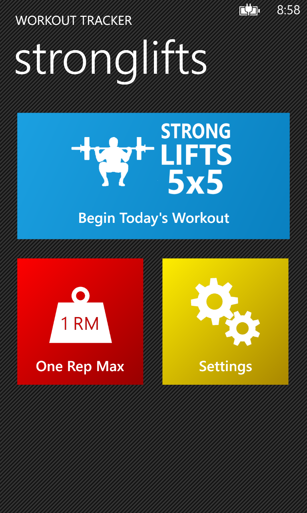
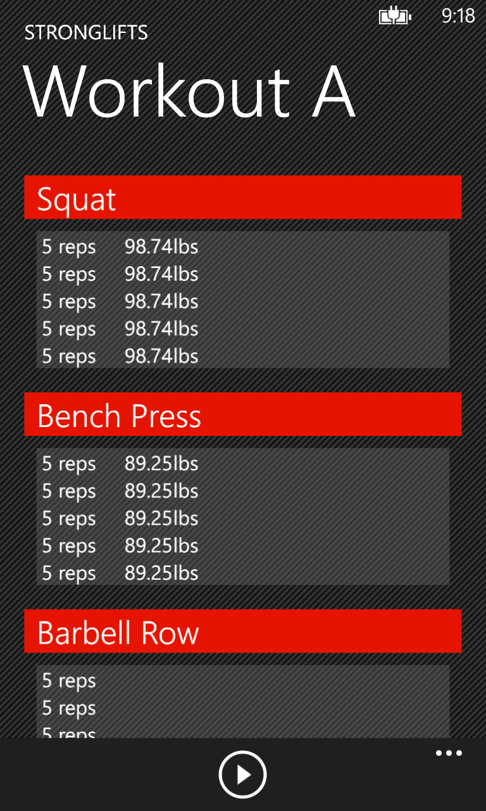

I have new published app on the market! There's still a lot of stuff I want to add to the app in the coming weeks/months, but it was ready for a v1 release. I'll update this post once new stuff has been pushed to the app.

Basically I was looking for an app to manage my gym routine and track my progress. While there are quite a few gym apps in the marketplace, I couldn't find one that fit what I needed. There are apps to log your workouts, or that include their own plans, but I wanted something that told me all the details from the exercises I should be doing: how many reps, rest time, how much weight to lift and so on, and keep track of it so that as I progress the app keeps up and increases the weights, etc, like a personal trainer would do.
<!--more-->

So that's what I set off to build. Now, at the present moment it won't be able to do everything without a little help, and it's limited to one plan. But underneath it's ready to handle a lot more.

I built an entire library to handle the workout and it should soon support cardio exercises as well. This library will handle all the workout calculations and defines the viewmodels available to the app, which will allow me to build some other apps based on the same code.

The Stronglifts Tracker app itself merely presents the content provided by my library to the user.

StrongliftsTracker is available to download from the marketplace at: <a href="http://bit.ly/strongliftswp8">http://bit.ly/strongliftswp8</a>

Source code is available on <a href="https://github.com/fmmendo/WorkoutTracker">github</a>.
