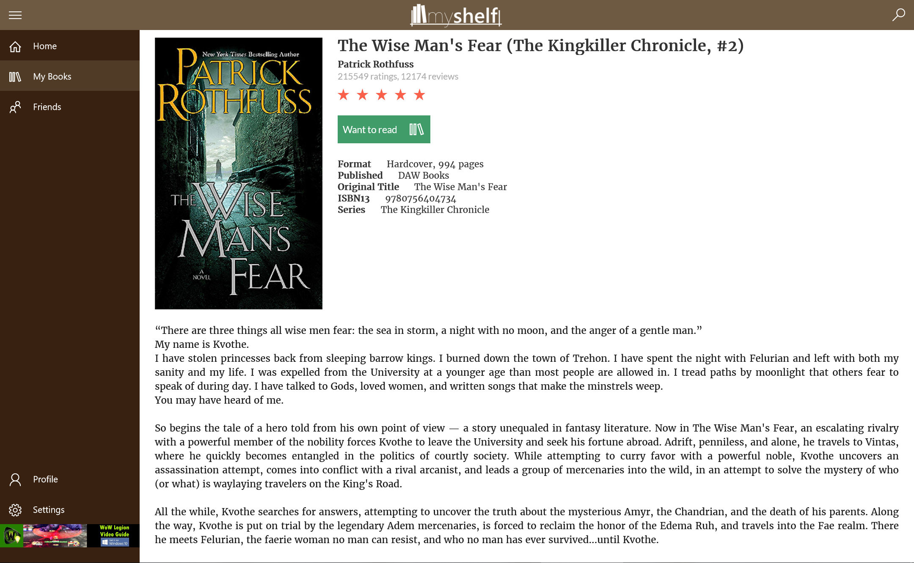

I finally published my <a href="http://www.goodreads.com/">Goodreads</a> client: myShelf. It has actually been on the store for a while, but I just haven't had time to do a quick write down on it.

There were a few reasons behind building this app: the main website looked a bit dull (it has since been updated to look more modern), and not that good on mobile, but offered a lot of great features for people who loved to read; it lacked an official app, and the unofficial ones were a bit lacklustre; and I'd been wanting to build something bigger, different from my last few apps, and closer to what I actually do at work.

There is still more work to be done, as always, but the it currently provides enough functionality that I was finally comfortable with publishing it. You've got your main feed, where the social network aspect of goodreads takes place. Also, just like the website, whatever you're currently reading is accessible right from the main page, so you can quickly jump in and out of the app for a quick update.

You're also able to search for book and author information, and add books to your bookshelves. There isn't much shelf management implemented yet, the basic is there, more will come. You can also check up on your friend's profiles and see what they've been doing.

Over the course of building this I've realized the while Goodreads provides lots of data via their API, things are a bit clunky. API calls don't always return the data you need, so you end up needing to make multiple calls to build a decent page. This is more of a problem since they expect you to not hit their API more than once a second. I understand it prevents abuse, but it also means a nicely crafted page in an app would take precious seconds to load, compared with "instantly" while using the web.

All in all, there's still work to be done (especially trying to hide all the delays caused by API calls), but I'm happy it's finally published.

